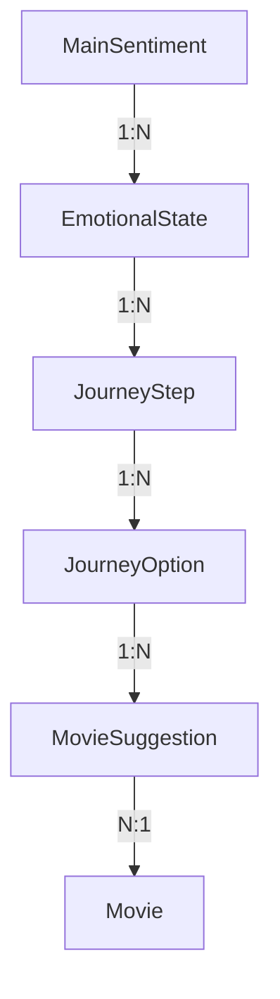

# Guia de Cadastro de Estados Emocionais

Este documento descreve a estrutura e sequência de cadastro para os estados emocionais e jornada do usuário no sistema de recomendação de filmes.

## Estrutura de Dados



## Sequência de Cadastro

### 1. MainSentiment (Sentimento Principal)
- Nome
- Descrição
- Keywords

### 2. EmotionalState (Estado Emocional)
- Nome
- Descrição
- Vínculo com MainSentiment
- Status (ativo/inativo)

### 3. JourneyStep (Passos da Jornada)
- Pergunta
- Ordem do passo (número que indica a profundidade do passo na árvore de decisão)
- Identificador hierárquico (stepId: 1, 2A, 2B, etc)
- Vínculo com EmotionalState

### 4. JourneyOption (Opções de Resposta)
- Texto da opção
- Vínculo com JourneyStep
- NextStepId (próximo passo, se houver)
- IsFinal (indica se é uma opção final)

### 5. MovieSuggestion (Sugestões de Filmes)
- Vínculo com Movie
- Vínculo com EmotionalState
- Vínculo com JourneyOption
- Razão da sugestão
- Relevância

## Regras Importantes

1. Um MainSentiment pode ter vários EmotionalStates
2. Cada EmotionalState deve ter pelo menos um JourneyStep
3. Cada JourneyStep deve ter pelo menos uma JourneyOption
4. Uma JourneyOption pode:
   - Levar a outro JourneyStep (nextStepId)
   - Ser final (isFinal = true) e levar a MovieSuggestions

## Estrutura de Ordenação dos Steps

O campo `order` em JourneyStep representa a profundidade do passo na árvore de decisão. A estrutura funciona da seguinte forma:

1. O primeiro passo sempre tem `order = 1`
2. Os passos subsequentes podem ter ordens diferentes dependendo do caminho da jornada
3. Steps no mesmo nível de profundidade podem ter a mesma ordem
4. A ordem ajuda a visualizar quantos passos o usuário precisará percorrer até chegar a uma sugestão

### Exemplo de Ordenação

```
Step 1 (order: 1) "Como você está se sentindo?"
├── Opção A → Step 2A (order: 2) "Por que está feliz?"
│   ├── Opção A1 → Step 3A (order: 3) "Quer comemorar?"
│   └── Opção A2 → Step 3B (order: 3) "Quer manter o astral?"
└── Opção B → Step 2B (order: 2) "O que está te deixando triste?"
    ├── Opção B1 → Step 3C (order: 3) "Quer se distrair?"
    └── Opção B2 → Step 3D (order: 3) "Quer refletir?"
```

Neste exemplo:
- Todos os steps marcados com "2" são segundos passos em diferentes caminhos
- Todos os steps marcados com "3" são terceiros passos em diferentes caminhos
- Steps com mesma ordem (ex: 3A, 3B, 3C, 3D) representam a mesma profundidade em diferentes ramificações

## Estrutura de Identificação dos Steps

O campo `stepId` em JourneyStep representa a identificação hierárquica do passo na árvore de decisão. A estrutura funciona da seguinte forma:

1. O primeiro passo sempre tem `stepId = "1"`
2. Os passos subsequentes são identificados com número e letra: "2A", "2B", "2C", etc.
3. Se houver mais níveis, continua-se a numeração: "3A", "3B", etc.
4. Esta identificação torna mais clara a relação entre os passos e suas ramificações

### Exemplo de Identificação

```
Step 1 (stepId: "1") "Como você está se sentindo?"
├── Opção A → Step 2A (stepId: "2A") "Por que está feliz?"
│   ├── Opção A1 → Step 3A (stepId: "3A") "Quer comemorar?"
│   └── Opção A2 → Step 3B (stepId: "3B") "Quer manter o astral?"
└── Opção B → Step 2B (stepId: "2B") "O que está te deixando triste?"
    ├── Opção B1 → Step 3C (stepId: "3C") "Quer se distrair?"
    └── Opção B2 → Step 3D (stepId: "3D") "Quer refletir?"
```

## Exemplo Prático Completo

```
MainSentiment: "Alegria"
└── EmotionalState: "Comemorativo"
    ├── Step 1 (order: 1): "Qual o motivo da celebração?"
    │   ├── "Conquista pessoal" → Step 2A (order: 2)
    │   ├── "Reunião familiar" → Step 2B (order: 2)
    │   └── "Momento romântico" → Step 2C (order: 2)
    │
    ├── Step 2A (order: 2): "Que tipo de conquista?"
    │   ├── "Profissional" → MovieSuggestions
    │   └── "Acadêmica" → MovieSuggestions
    │
    ├── Step 2B (order: 2): "Que tipo de reunião?"
    │   ├── "Aniversário" → MovieSuggestions
    │   └── "Confraternização" → MovieSuggestions
    │
    └── Step 2C (order: 2): "Como está o clima?"
        ├── "Casual" → MovieSuggestions
        └── "Especial" → MovieSuggestions
```

## Recomendações para Cadastro

1. Comece cadastrando os MainSentiments principais

2. Para cada EmotionalState:
   - Planeje a jornada completa antes de começar o cadastro
   - Desenhe o fluxo de perguntas e respostas
   - Identifique os pontos finais que levarão a sugestões de filmes
   - Mantenha a ordem dos steps consistente com a profundidade da árvore

3. Ao cadastrar MovieSuggestions:
   - Vincule com opções finais específicas
   - Defina a relevância baseada no contexto
   - Forneça uma razão clara para a sugestão

Isso ajuda a manter uma estrutura organizada e coerente para a jornada do usuário. 